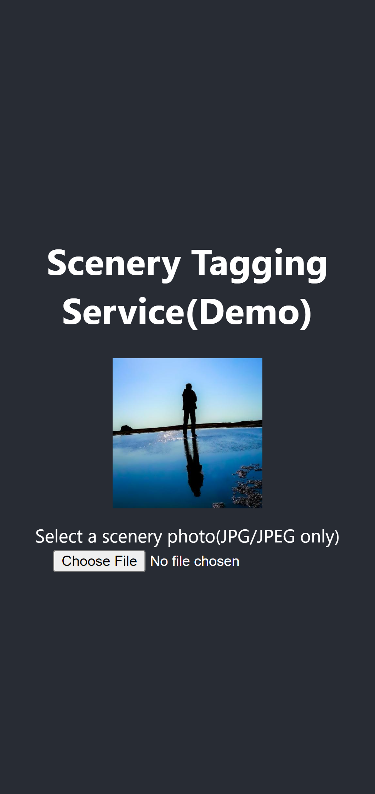
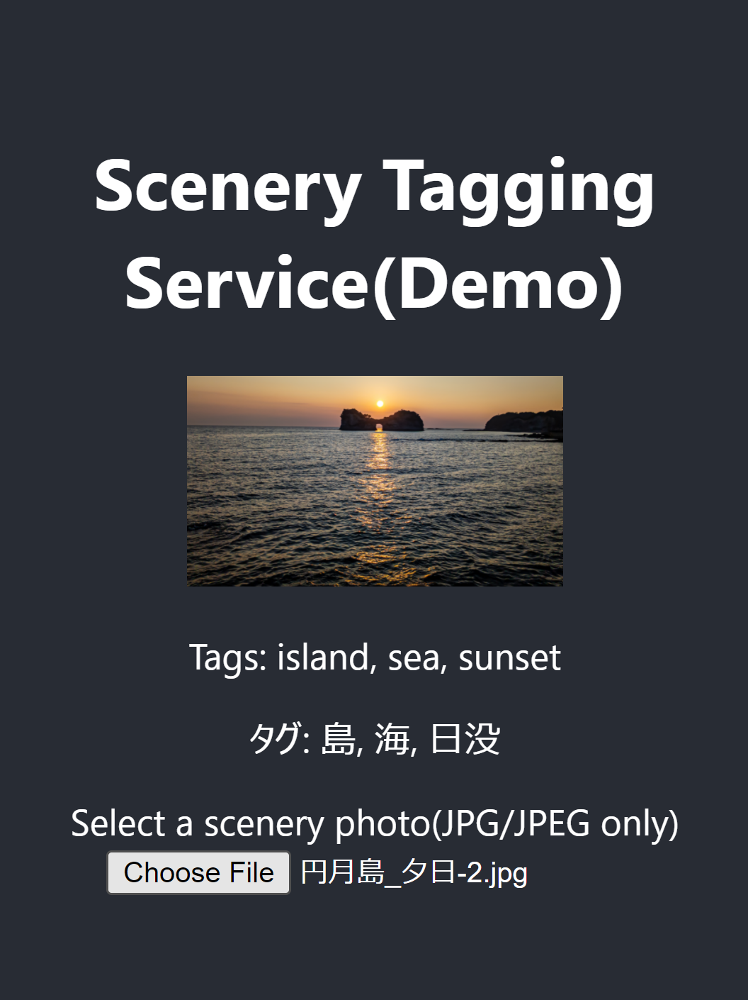
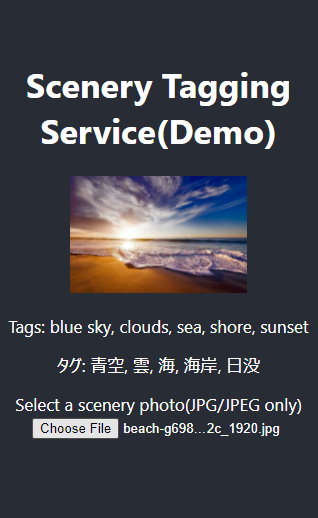
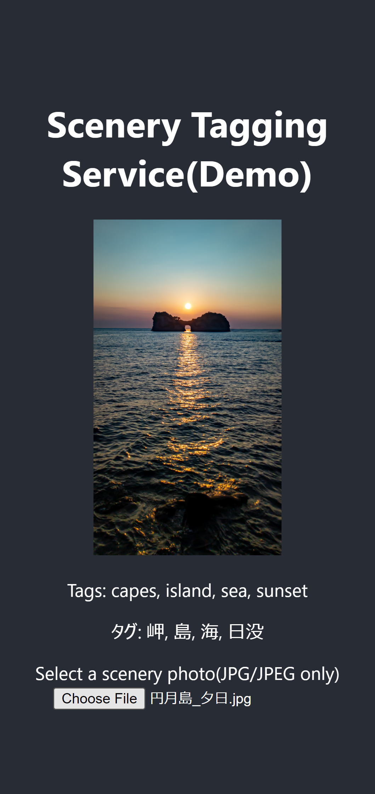

# Sample Project
**In currently, there is no place to put pretrained model, so this sample won't run.**

To use this, run this code.
```shell
python app.py
```

## From browser
Access to the link: http://127.0.0.1:5000/

## Use from API
Run this script.
```shell
python send_api.py
```

### Remarks
- You can't upload greater than 10MB image.

### Response
- Status code: 200 is "Success"
- Status code: 400 is "Bad Request"
- Status code: 413 is "Max Content Length Over"
- Status code: 500 is "Internal Server Error"

## Screen samples
### Before upload image

<!--  -->

### After upload image



<!-- 

 -->

### API sample
```shell
$ python send_api.py
```
```shell
200
{'predict_tags': {'English': ['dessert', 'mountains'], '日本語': ['砂漠', '山']}}
```